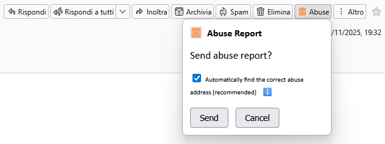

# PIT Abuse Reporter

**PIT Abuse Reporter** is a lightweight Thunderbird add-on that helps you quickly report abuse for unsolicited emails.

The add-on extracts the sender’s domain, looks for an official abuse reporting address using **DMARC**, and prepares a ready-to-send abuse report with headers and the raw message included.

---

## 🚀 Features

- Adds an **“Abuse”** button in the Thunderbird message toolbar  
- Automatically detects the sender’s domain  
- Looks up **DMARC rua=** reporting addresses  
- Falls back to **abuse@domain** when no DMARC address is available  
- Opens a compose window with:
  - Pre-filled recipient (abuse address)
  - Subject
  - Message headers
  - Raw `.eml` attached
- Popup with on-the-fly options  
- Options page available in Thunderbird settings

---

## 🖼 Screenshot

---

## 📁 Source Code Structure

manifest.json
background.js
popup.html
popup.js
options.html
options.js
createxpi.bat
icon16.png
icon32.png
icon48.png
icon64.png

---

## 🛠 Development

To load the extension temporarily in Thunderbird:

1. Go to **Tools → Developer Tools → Add-ons Debugging**
2. Enable **“Enable add-on debugging”**
3. Click **Load Temporary Add-on**
4. Select `manifest.json`

---

## 📦 Packaging for AMO

This project includes a ready-to-use batch script:

### **createxpi.bat**

Simply run:

createxpi.bat

This will:

- Collect all required files  
- Create a clean `.xpi` archive  
- Save it in the project folder, ready for upload to AMO  

No additional tools or commands needed.

---

## 🧩 Requirements

- Thunderbird **115+**
- Manifest **v2**
- Permissions:
  - `messagesRead`
  - `accountsRead`
  - `compose`
  - `tabs`
  - `storage`

---

## 📜 License

MIT License  
© Alberto Franchi (Punto IT s.r.o.)

---
